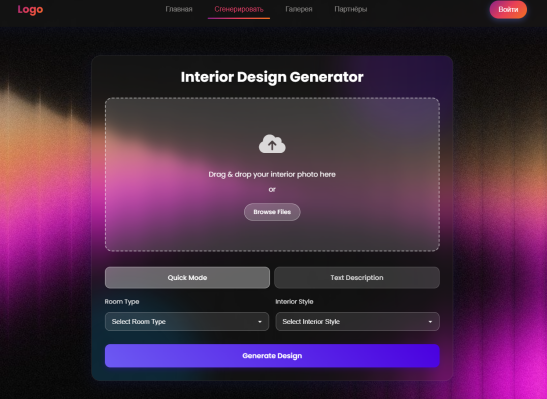

# Проект по генерации редизайна интерьера!

Представляет собой веб-сервис использующий несколько моделей ИИ.

## Краткое описание функционала
Данное приложение позволяет сгенерировать редизайн интерьера вашей комнаты, а также выдать рекомендации для покупки реальной мебели от партнёров, схожей с той, что была сгенерирована.
 
AI:
1. Генерация изображения 
2. Сегментация мебели
3. Преобразование изображений в вектор
4. Поиск при помощи сегментированной мебели по векторной базе данных для рекомендаций 

Web:
5. Аутентификация 
6. Генерация
7. Сохранение в галереи
8. Админ модуль

## Подробное описание
Стэк: Python, NumPy, OpenCV, PyTorch, PostgreSQL, React. FastAPI, ChromaDB и Transformers.

Исходное изображение

1. Генерация
Используется ControlNet Image 2 image Пайплайн
Для генерации интерьеров используется модель SG161222/Realistic_Vision_V5.1_noVAE в качестве основы. 
ControlNet - lllyasviel/control_v11p_sd15_canny.
 Вариационный автоэнкодер (VAE). Выбор stabilityai/sd-vae-ft-mse.
 
 2. Сегментация мебели
 Модель "facebook/mask2former-swin-large-coco-panoptic", либо  “facebook/mask2former-swin-large-ade-panoptic”, в зависимости от специфики продукции партнёра.
 
 3. Перевод сегментированного изображения в вектор и поиск
 Перевод в вектор производится при помощи модели CLIP, после чего чего по схожести ищем в векторной базе данных ChromaDB
4. Выдача наиболее схожих вариантов мебели.
